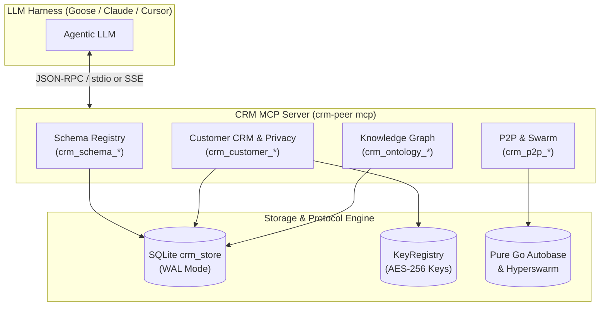

# Agent Integration Guide: Model Context Protocol (MCP) Server

This guide provides complete instructions for autonomous AI agents and LLM harnesses—including **Block Goose**, **Claude Desktop**, **Cursor**, and **Antigravity**—to configure, connect, and utilize the Distributed Multimodal Agentic CRM via the Model Context Protocol (MCP).

- **System Architecture**: Refer to [ARCHITECTURE.md](/ARCHITECTURE.md) for data flow and storage engine details.
- **Repository Readme**: Refer to [README.md](/README.md) for build commands and CLI reference.

---

## 1. Quick Setup & Binary Compilation

Before connecting your agent harness, build the single-binary executable:

```bash
# Clone and build the binary
go build -o bin/crm-peer cmd/crm-peer/main.go
```

The resulting binary (`bin/crm-peer`) contains both the CRM daemon and the integrated MCP server runtime.

---

## 2. Agent Harness Configurations

### 2.1 Block Goose Integration

[Block Goose](https://github.com/block/goose) is an open-source, on-machine AI developer agent. You can configure the CRM MCP server in Goose via CLI or the configuration file.

#### Option A: Via Goose CLI
```bash
goose configure
# Select "Add an Extension"
# Choose "Standard I/O (stdio)"
# Extension Name: crm-mcp
# Command: /path/to/crm-sqlite-pear-p2p/bin/crm-peer
# Arguments: mcp
```

#### Option B: Via `~/.config/goose/config.yaml`
Add the following entry under `extensions:` in your Goose configuration file:

```yaml
extensions:
  crm_peer:
    name: crm-peer
    type: stdio
    cmd: /home/innomon/B204-zone/owly-sewa/crm-sqlite-pear-p2p/bin/crm-peer
    args:
      - mcp
    envs:
      CRM_MCP_TRANSPORT: stdio
    enabled: true
```

#### Goose Hints (`.goosehints`)
Place a `.goosehints` file in your workspace root to help Goose understand when to use CRM tools:
```markdown
# CRM Agent Guidelines
- To manage customer records, use `crm_customer_put` and `crm_customer_get`. Phone numbers are automatically converted into privacy-preserving Base32 keys.
- To enforce GDPR deletion or right-to-be-forgotten, call `crm_customer_shred`. Never attempt to alter raw append-only logs directly.
- Always verify record schemas before bulk insertion using `crm_schema_get` or `crm_schema_list`.
- For relationship queries between entities, use `crm_ontology_get_node` and `crm_ontology_query_edges`.
```

---

### 2.2 Claude Desktop Integration

Edit your Claude Desktop configuration file:
- **macOS**: `~/Library/Application Support/Claude/claude_desktop_config.json`
- **Linux**: `~/.config/Claude/claude_desktop_config.json`
- **Windows**: `%APPDATA%\Claude\claude_desktop_config.json`

#### Stdio Mode (Recommended for Local Desktop)
```json
{
  "mcpServers": {
    "crm-peer": {
      "command": "/home/innomon/B204-zone/owly-sewa/crm-sqlite-pear-p2p/bin/crm-peer",
      "args": ["mcp"]
    }
  }
}
```

#### SSE Mode (Remote / Background Daemon)
If running `crm-peer mcp --transport=sse --port=8083` in the background:
```json
{
  "mcpServers": {
    "crm-peer": {
      "url": "http://127.0.0.1:8083/mcp"
    }
  }
}
```

---

### 2.3 Cursor Integration

In Cursor, open **Settings > Features > MCP Servers** or create a `.cursor/mcp.json` file in your repository:

```json
{
  "mcpServers": {
    "crm-peer": {
      "command": "/home/innomon/B204-zone/owly-sewa/crm-sqlite-pear-p2p/bin/crm-peer",
      "args": ["mcp"]
    }
  }
}
```

---

### 2.4 Antigravity / Gemini CLI Integration

In your Antigravity or Gemini CLI workspace configuration:

```json
{
  "mcp_servers": {
    "crm-peer": {
      "command": "/home/innomon/B204-zone/owly-sewa/crm-sqlite-pear-p2p/bin/crm-peer",
      "args": ["mcp"],
      "env": {
        "CRM_MCP_TRANSPORT": "stdio"
      }
    }
  }
}
```

---

## 3. Complete MCP Tool Catalog

The CRM MCP server exposes 12 specialized tools grouped into 4 functional domains.



---

### 3.1 Schema Registry Tools

Manage machine-readable contracts and documentation under the `org.schema:<URI>` namespace.

#### `crm_schema_set`
Register or update a schema contract definition.
- **Parameters**:
  - `uri` (string, required): Schema identifier or URL (e.g. `https://schema.org/Customer` or `customer-v1`).
  - `schema_json` (string, required): Valid JSON Schema object as a string.
  - `doc_markdown` (string, required): Markdown documentation describing fields and use-cases.
- **Example Call**:
  ```json
  {
    "uri": "https://schema.org/Customer",
    "schema_json": "{\"type\":\"object\",\"properties\":{\"tier\":{\"type\":\"string\"},\"company\":{\"type\":\"string\"}}}",
    "doc_markdown": "# Customer Schema v1\nDefines client tier and company attributes."
  }
  ```

#### `crm_schema_get`
Retrieve a schema definition and documentation by URI.
- **Parameters**:
  - `uri` (string, required): Schema URI or canonical key.
- **Returns**: `uri`, `key`, `schema_json`, and `doc_markdown`.

#### `crm_schema_list`
List all registered schemas under the `org.schema:*` namespace.
- **Parameters**:
  - `limit` (integer, optional): Maximum number of schemas to return (default: 50).
  - `offset` (integer, optional): Pagination offset.

#### `crm_schema_delete`
Delete a schema definition from the store.
- **Parameters**:
  - `uri` (string, required): Schema URI to delete.

---

### 3.2 Customer Management & Privacy Tools

Execute customer operations with automated Base32 identifier hashing and AES-256-GCM payload encryption.

#### `crm_customer_put`
Upsert a customer record.
- **Parameters**:
  - `phone_or_key` (string, required): Customer phone number (e.g. `+1-555-123-4567`) or 52-char Base32 hashed key.
  - `metadata` (string, required): JSON metadata object string.
  - `payload` (string, optional): Sensitive customer text or JSON payload. Automatically encrypted at rest using AES-256-GCM.
- **Example Call**:
  ```json
  {
    "phone_or_key": "+1-555-123-4567",
    "metadata": "{\"tier\":\"enterprise\",\"region\":\"APAC\"}",
    "payload": "Customer contract details: Annual value $120,000, SLA: 4 hours"
  }
  ```

#### `crm_customer_get`
Fetch a customer record. Decrypts the payload using the customer's symmetric key.
- **Parameters**:
  - `phone_or_key` (string, required): Phone number or Base32 key.
- **Returns**: `key`, `metadata`, and decrypted `payload`.

#### `crm_customer_delete`
Remove a customer record from `crm_store` and purge its key.
- **Parameters**:
  - `phone_or_key` (string, required): Phone number or Base32 key.

#### `crm_customer_shred`
**GDPR Cryptographic Shredding**: Permanently purges the AES-256 encryption key from the key registry. The customer's ciphertext payload becomes permanently and mathematically irrecoverable, satisfying GDPR right-to-be-forgotten on immutable append-only logs without breaking P2P hash chains.
- **Parameters**:
  - `phone_or_key` (string, required): Phone number or Base32 key.
- **Returns**: `success: true` and confirmation message.

#### `crm_customer_list`
List customer records with pagination.
- **Parameters**:
  - `limit` (integer, optional): Number of records (default: 50).
  - `offset` (integer, optional): Pagination offset.

---

### 3.3 Knowledge Graph & Ontology Tools

Inspect and traverse entity relationships indexed from Markdown frontmatter files.

#### `crm_ontology_get_node`
Fetch node metadata, label, and type.
- **Parameters**:
  - `node_id` (string, required): Entity node ID (e.g. `customer:cust-101`, `agent:support-01`).

#### `crm_ontology_query_edges`
Query outgoing relationships from a source node.
- **Parameters**:
  - `source_id` (string, required): Source node ID.
- **Returns**: Array of directed edges with `target`, `relationship`, and `weight`.

#### `crm_ontology_search`
Search graph nodes by entity type or text keyword.
- **Parameters**:
  - `type` (string, optional): Filter by type (e.g. `customer`, `agent`, `ticket`).
  - `query` (string, optional): Search substring in ID or label.

---

### 3.4 P2P Swarm & Observability Tools

Monitor peer mesh health and trigger consensus synchronization.

#### `crm_p2p_status`
Returns node version, DB path, WAL mode, active Hyperswarm topics, and connected peer count.

#### `crm_p2p_peers`
Lists connected peers in the P2P cluster.

#### `crm_p2p_sync`
Forces an immediate Autobase reconciliation sweep, replaying local changeset feeds to all active peers.

---

## 4. Autonomous Agent Playbooks

### Playbook 1: Schema-First Customer Registration
When an agent is tasked with onboarding a customer:
1. Call `crm_schema_get` with the schema URI (e.g. `https://schema.org/Customer`) to review required properties and constraints.
2. If the schema does not exist, call `crm_schema_set` to register the contract.
3. Validate customer attributes against the JSON Schema.
4. Call `crm_customer_put` passing the phone number, schema-conforming metadata, and private profile payload.

### Playbook 2: GDPR Right-to-be-Forgotten Request
When an agent receives a deletion or erasure request:
1. Call `crm_customer_get` to confirm record existence.
2. Call `crm_customer_shred` with the customer's identifier.
3. Call `crm_customer_get` again and verify that payload decryption fails with a `crypto-shredded` error.
4. Inform the user that the customer's data has been cryptographically erased and cannot be decrypted by any party.

### Playbook 3: Knowledge Graph Entity Exploration
When an agent needs context on customer relationships:
1. Call `crm_ontology_search` with `type: "customer"` and keyword query.
2. For matching nodes, call `crm_ontology_query_edges` with `source_id` to discover assigned agents, open tickets, or related organizations.
3. Reason over the resulting graph topology to answer customer context queries.
