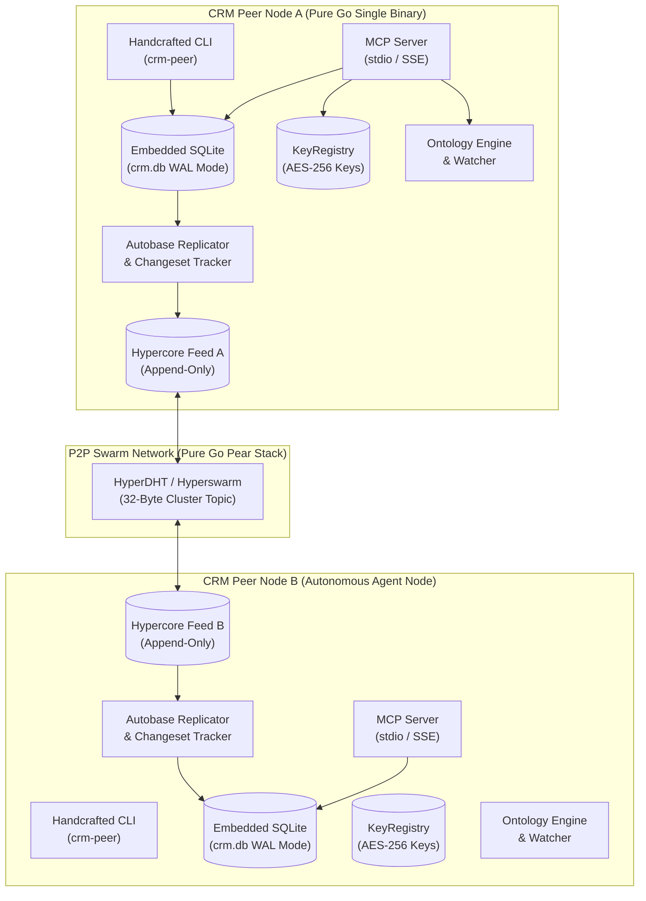
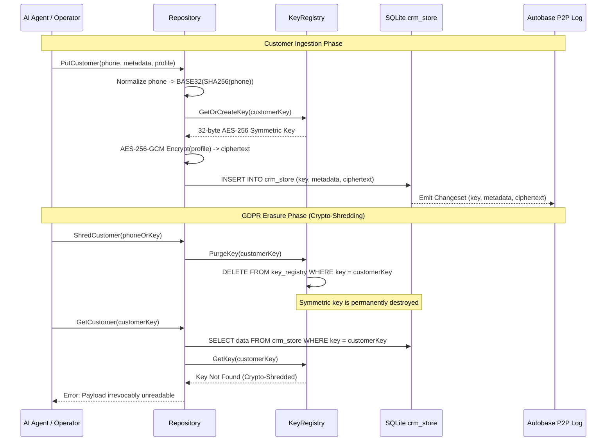
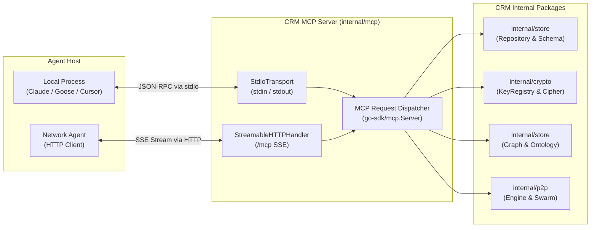

# Technical Architecture: Distributed Multimodal Agentic CRM

This document describes the architectural foundation, data models, protocols, and privacy mechanisms powering the Distributed Multimodal Agentic CRM.

- **Developer Setup & Build Guide**: Refer to [README.md](/README.md) for build and execution instructions.
- **LLM Agent Integration**: Refer to [AGENT.md](/AGENT.md) for Model Context Protocol (MCP) usage and tooling playbooks.

---

## 1. System Topology & Architectural Overview

The CRM operates as a decentralized, multi-writer peer-to-peer system scaling to 100K+ customer records. It has zero dependencies on centralized cloud databases, cloud message brokers, or external SaaS infrastructure.



---

## 2. Core Architectural Pillars

### 2.1 Pure Go & Zero-CGO Runtime
The entire software stack—including the database engine, cryptographic primitives, P2P networking, and CLI—compiles to a single static binary with `CGO_ENABLED=0`. SQLite is embedded using `modernc.org/sqlite`, eliminating dynamic C library dependencies and allowing seamless cross-compilation across Linux, macOS (Apple Silicon & Intel), and Windows.

### 2.2 Command Query Responsibility Segregation (CQRS)
To achieve multi-master concurrency without locking or distributed 2-phase commits:
- **Write Path**: Client mutations execute locally against SQLite in Write-Ahead Logging (WAL) mode. Mutations are captured as atomic changesets via the SQLite Session API and appended to a local append-only Hypercore feed.
- **Read Path**: All queries (customer lookups, schema queries, full-text searches, and recursive graph traversals) execute locally against SQLite with $O(1)$ key lookup or $O(\log N)$ indexed index scans. There is zero network round-trip overhead on reads.

### 2.3 Causal Ordering & Autobase Consensus
Each writing peer maintains its own append-only cryptographic Hypercore feed. The pure Go **Autobase** engine ingests feeds from all discovered peers in the swarm and linearizes them into a single causally ordered virtual stream using vector clocks. In the event of concurrent modifications to the same customer key, conflict resolution defaults to deterministic Last-Writer-Wins (LWW) evaluation based on sequence number and compound timestamps.

---

## 3. Storage Architecture: Unified Single-Table Schema

All CRM records, customer profiles, and schema definitions reside in a single table without `ROWID`:

```sql
CREATE TABLE IF NOT EXISTS crm_store (
    key      TEXT PRIMARY KEY,
    metadata TEXT CHECK(json_valid(metadata)),
    data     BLOB
) WITHOUT ROWID;
```

### 3.1 Primary Key Namespaces & Partitioning
Key prefixes cleanly isolate functional domains within the single unified table:

| Domain | Key Pattern | Metadata Format | Data Payload |
|---|---|---|---|
| **Customer Records** | `in.qzip.crm.customer:<BASE32>` | JSON metadata (schemas, tiers, tags) | `AES-256-GCM` encrypted customer profile |
| **Schema Registry** | `org.schema:<URI>` | JSON Schema contract object | Markdown (`.md`) operational documentation |
| **System Settings** | `config:<NAME>` | JSON configuration object | Raw configuration bytes |

---

## 4. Privacy-First & Cryptographic Shredding Architecture

Decentralized append-only logs are inherently immutable. However, global privacy laws (such as GDPR Article 17 "Right to be Forgotten") require data erasure. The CRM solves this dilemma through **Deterministic Pseudonymization** paired with **Cryptographic Shredding**.



1. **Deterministic Pseudonymization**: Raw customer identifiers (e.g. phone numbers) never appear as primary keys. They are normalized and hashed:
   $$\text{Key} = \text{CustomerNamespace} + \text{":"} + \text{BASE32}(\text{SHA-256}(\text{Normalize}(\text{phone})))$$
2. **Per-Customer Symmetric Encryption**: Customer payloads written to SQLite and replicated over Autobase are encrypted with a dedicated 256-bit symmetric key (`AES-256-GCM`).
3. **Cryptographic Erasure**: Deleting the symmetric key from the `key_registry` permanently destroys the ability to decrypt the ciphertext. Historic Hypercore log blocks remain cryptographically valid without breaking peer replication trees, while the underlying customer PII is rendered permanently unrecoverable mathematical noise.

---

## 5. Schema Registry Engine (`org.schema:*`)

The schema registry provides machine-readable contracts and human-readable documentation directly inside the distributed store:
- **Namespace**: `org.schema:<URI>` (e.g. `org.schema:https://schema.org/Customer`).
- **Metadata Column**: Contains the formal JSON Schema validating customer record properties.
- **Data Column**: Contains a Markdown document explaining the purpose, constraints, and field descriptions.
- **MCP Integration**: Agents can discover schemas at runtime using `crm_schema_list`, fetch validation rules with `crm_schema_get`, and register new domain contracts via `crm_schema_set`.

---

## 6. Multimodal Knowledge Graph & Ontology Engine

Unstructured customer interaction notes and markdown documents are monitored and ingested into localized SQLite graph tables:

```sql
CREATE TABLE IF NOT EXISTS ontology_nodes (
    id       TEXT PRIMARY KEY,
    label    TEXT NOT NULL,
    type     TEXT NOT NULL,
    metadata TEXT CHECK(metadata IS NULL OR json_valid(metadata))
);

CREATE TABLE IF NOT EXISTS ontology_edges (
    source       TEXT NOT NULL,
    target       TEXT NOT NULL,
    relationship TEXT NOT NULL,
    weight       REAL DEFAULT 1.0,
    metadata     TEXT CHECK(metadata IS NULL OR json_valid(metadata)),
    PRIMARY KEY (source, target, relationship)
);
```

- **File System Watcher**: `fsnotify` monitors designated documentation directories.
- **YAML Frontmatter Parser**: Ingests document metadata into `ontology_nodes` and `ontology_edges`.
- **Recursive CTE Graph Traversal**: Multi-hop relationship traversals (e.g. finding all agents assigned to tickets associated with high-tier customers) execute via recursive SQL CTEs:

```sql
WITH RECURSIVE graph_cte(node_id, depth, path, total_weight) AS (
    SELECT id, 0, id, 0.0 FROM ontology_nodes WHERE id = ?
    UNION ALL
    SELECT e.target, g.depth + 1, g.path || ' -> ' || e.target, g.total_weight + e.weight
    FROM ontology_edges e
    JOIN graph_cte g ON e.source = g.node_id
    WHERE g.depth < ? AND instr(g.path, e.target) = 0
)
SELECT * FROM graph_cte;
```

---

## 7. Model Context Protocol (MCP) Server Architecture

The MCP server integrates directly into `crm-peer` using `github.com/modelcontextprotocol/go-sdk`:



### Stdio Stream Isolation
When running in `stdio` mode, the JSON-RPC protocol requires that standard output (`stdout`) remains completely unpolluted. All structured logging (`internal/logger`) is automatically directed to `stderr` or rolling log files, guaranteeing zero frame corruption during agent tool calls.

---

## 8. Handcrafted Command Architecture

To adhere to strict zero-dependency and minimal binary footprint rules, the CLI dispatch engine is completely handcrafted without `spf13/cobra` or `pflag`.
- The CLI command tree is declared with typed handler callbacks (`HandlerFunc`).
- Flag parsing is executed via custom string token matching (`--transport=`, `--port=`, etc.).
- The command tree provides deterministic `--help` formatting and fast startup latency ($<5\text{ms}$).

---

## 9. Embeddable Storage Architecture (`pkg/whatsadk`)

The `pkg/whatsadk` package exposes an embeddable adapter implementing the WhatsaDK `storeBackend` interface directly over the unified `crm_store` table and Autobase P2P replication mesh.

### 9.1 Data Projection & SQLite Views
Rather than requiring separate relational tables, all WhatsaDK entities are partitioned within `crm_store` using key prefixes:
- `whatsadk:filesys:<path>`
- `whatsadk:contact:<our_jid>:<their_jid>`
- `whatsadk:command:<id>`
- `whatsadk:blacklist:<phone>`

To support raw SQL queries and existing analytical integrations without rewriting queries, SQLite Views (`filesys`, `whatsmeow_contacts`, `whatsmeow_commands`, `blacklisted_numbers`) project JSON attributes into relational columns. Parameter syntax (`$1, $2`) is normalized to SQLite parameter binding (`?`) in `QueryFilesys`.

### 9.2 Binary Media Architecture
WhatsApp media messages (images, audio notes, video) are ingested via `PutFile` as raw BLOBs in `crm_store.data`, paired with JSON metadata in `crm_store.metadata`. Message logging queries (`GetFilesysLogs` and `GetLatestGlobalMessages`) use conditional projection to exclude binary payloads from list operations, reserving byte retrieval for explicit `GetFile` requests.

### 9.3 Decentralized Changeset Replication
Every write to WhatsaDK entities automatically flows through `store.ChangesetTracker` or `p2p.ReplicationEngine`, producing binary changesets broadcast across peer swarm nodes. When customer key registries are enabled, media and message payloads are encrypted with AES-256-GCM, enabling cryptographically enforceable GDPR deletion across all nodes.

