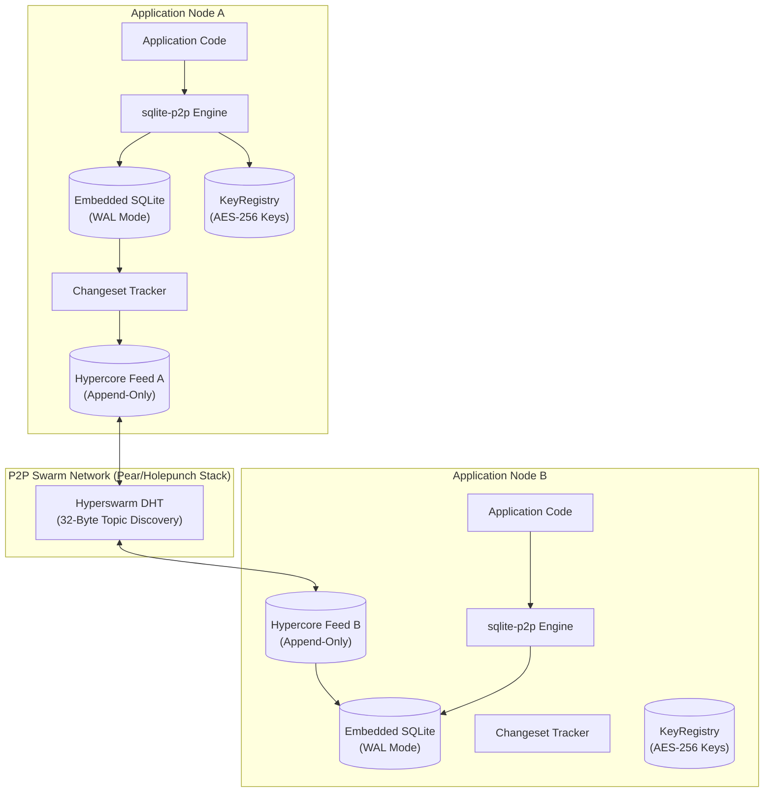

# Technical Architecture: sqlite-p2p

This document describes the architectural foundation, data protocols, and synchronization mechanisms powering the `sqlite-p2p` decentralized database engine.

- **Developer Setup & Usage Guide**: Refer to [README.md](/README.md) for embedding and API instructions.
- **Application Layer Reference**: Refer to [crm-lite](file:///home/innomon/B204-zone/owly-sewa/crm-lite) for CRM application implementation details.

---

## 1. System Topology & Architectural Overview

`sqlite-p2p` is a decentralized, local-first database engine that linearizes mutations across independent peer nodes without centralized servers, brokers, or cloud storage.



---

## 2. Core Architectural Pillars

### 2.1 Pure Go & Zero-CGO Runtime
The entire engine compiles with `CGO_ENABLED=0` using `modernc.org/sqlite`. It contains no C library dependencies, ensuring portability across Linux, macOS, and Windows.

### 2.2 Generic Storage Schema
Persistent records are stored in a schema-agnostic key-value structure:

```sql
CREATE TABLE IF NOT EXISTS crm_store (
    key TEXT PRIMARY KEY,
    metadata TEXT CHECK(json_valid(metadata)),
    data BLOB
) WITHOUT ROWID;
```

### 2.3 Changeset Capture & Replication Flow
1. **Mutation**: A local write occurs via `engine.Put()` or `engine.Delete()`.
2. **Capture**: The `ChangesetTracker` constructs a timestamped binary changeset containing operation type (`OpInsert`, `OpUpdate`, `OpDelete`), monotonic sequence number, and previous hash.
3. **Feed Append**: Changesets are appended to the local append-only `Hypercore` feed.
4. **Peer Exchange**: Remote changesets stream over Hyperswarm peer connections.
5. **Autobase Reconciliation**: Changesets are linearized across peers using Last-Write-Wins (LWW) conflict resolution.

### 2.4 Cryptographic Shredding
- Payloads are encrypted using authenticated symmetric `AES-256-GCM`.
- Encryption keys are stored in a local `KeyRegistry`.
- Purging a key via `keys.PurgeKey(keyID)` renders all historical and replicated ciphertext permanently unrecoverable, fulfilling GDPR right-to-be-forgotten requirements while maintaining replication causal integrity.

### 2.5 HyperDHT Bootstrapping & Swarm Discovery
- **Zero Static Ports**: Hyperswarm binds to dynamic ephemeral ports (`Port: 0`) assigned by the OS, eliminating the need to expose or port-forward static TCP ports.
- **Air-Gapped & Offline by Default**: When `bootstrap` is empty or omitted, nodes do not dial public internet bootstrap servers. Instead, nodes operate as independent local DHT roots, ensuring zero data leakage and complete offline capability.
- **Cluster Bootstrapping**: In private LAN or VPN environments, one node serves as the initial cluster seed, and other nodes provide its dynamic DHT address in their `bootstrap` configuration. Once connected, peers discover each other automatically using the 32-byte Swarm Topic.
- **Encrypted Transport**: All peer communication is secured using Noise SecretStream sessions before exchanging Hypercore changesets.

