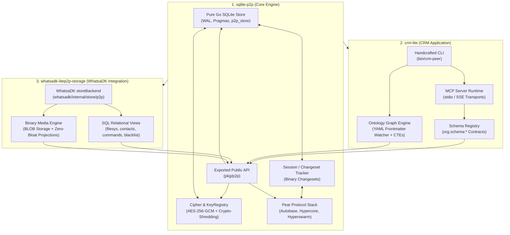
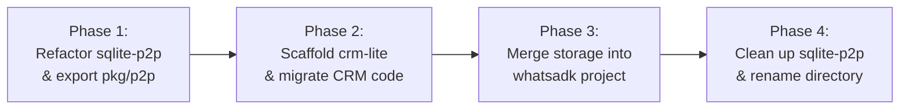

# Post-Split Technical Architecture & Decoupling Plan

This document details the architectural boundaries, dependency flows, package structures, and interface contracts resulting from decoupling the codebase into three independent, modular projects.

---

## 1. System Topology (Post-Split)



---

## 2. Decoupled Projects Overview

### Project 1: `sqlite-p2p` (The Core Engine)

- **Directory**: `/home/innomon/B204-zone/owly-sewa/sqlite-p2p`
- **Go Module**: `sqlite-p2p`
- **Scope & Role**:
  - A standalone, domain-agnostic, decentralized SQLite database engine library.
  - Zero application-layer concepts (no knowledge graph schemas, no customer tables, no WhatsApp types).
  - Provides local-first reads and writes in WAL mode with LWW (Last-Write-Wins) distributed multi-master reconciliation.
- **Exported Public Interface (`pkg/p2p`)**:

  ```go
  package p2p

  type EngineOptions struct {
      DBPath      string
      EnableWAL   bool
      SwarmTopic  [32]byte
      KeyRegistry *crypto.KeyRegistry
  }

  type Engine struct { ... }

  func OpenEngine(opts EngineOptions) (*Engine, error)
  func (e *Engine) DB() *sql.DB
  func (e *Engine) Repository() *store.Repository
  func (e *Engine) ChangesetTracker() *store.ChangesetTracker
  func (e *Engine) Close() error
  ```

### Project 2: `crm-lite` (The Application Layer)

- **Directory**: `/home/innomon/B204-zone/owly-sewa/crm-lite`
- **Go Module**: `crm-lite`
- **Scope & Role**:
  - The multimodal CRM application built on top of `sqlite-p2p`.
  - Manages customer identities (`BASE32(SHA256(phone))`), JSON Schema validation contracts (`org.schema:*`), Markdown frontmatter indexing with localized graph queries, and the native Model Context Protocol (MCP) server.
  - Handcrafted CLI dispatch tree (`bin/crm-peer`) with zero third-party CLI dependencies (no `cobra`/`pflag`).
- **Dependency Flow**: Imports `sqlite-p2p`.

### Project 3: `whatsadk-litep2p-storage` (Merged into WhatsaDK)

- **Target Directory**: Merged directly into `/home/innomon/B204-zone/orez/adk/whatsadk`
- **Scope & Role**:
  - The WhatsaDK `storeBackend` alternative to PostgreSQL and SurrealDB.
  - Lives inside WhatsaDK under `internal/store/p2p/` and is enabled via URI/DSN schemes (`sqlite-p2p://`, `pear://`, `sqlite://`).
  - Manages virtual filesys, binary media (images, audio, video) stored in SQLite BLOBs, WhatsApp contacts, command queueing, and blacklist tracking.
- **Dependency Flow**: WhatsaDK's `go.mod` imports `sqlite-p2p`.

---

## 3. Package Mapping Matrix

| Original Component (Monolith) | Target Project | Target Path | Function / Responsibility |
| --- | --- | --- | --- |
| `internal/store/db.go` | `sqlite-p2p` | `internal/store/db.go` | Pure Go SQLite connection, WAL mode, KV table |
| `internal/store/repository.go` | `sqlite-p2p` | `internal/store/repository.go` | Low-level KV CRUD and payload encryption |
| `internal/store/changeset.go` | `sqlite-p2p` | `internal/store/changeset.go` | SQLite Session API & changeset serialization |
| `internal/crypto/*` | `sqlite-p2p` | `internal/crypto/*` | AES-256-GCM cipher and key registry |
| `internal/p2p/*` | `sqlite-p2p` | `internal/p2p/*` | Autobase, Hypercore, Hyperswarm replication |
| `internal/logger/*` | `sqlite-p2p` | `internal/logger/*` | Structured logging (`slog`) |
| *(New)* | `sqlite-p2p` | `pkg/p2p/*` | Exported public API for embedding `sqlite-p2p` |
| `cmd/crm-peer/*` | `crm-lite` | `cmd/crm-peer/*` | CRM application binary entrypoint |
| `internal/cli/*` | `crm-lite` | `internal/cli/*` | Handcrafted CLI commands |
| `internal/mcp/*` | `crm-lite` | `internal/mcp/*` | MCP server runtime (`stdio`/`sse`) |
| `internal/ontology/*` | `crm-lite` | `internal/ontology/*` | Markdown frontmatter parser & file watcher |
| `internal/store/schema.go` | `crm-lite` | `internal/schema/*` | Schema registry (`org.schema:*`) |
| `internal/store/ontology.go` | `crm-lite` | `internal/ontology/store.go` | Graph tables & recursive CTE queries |
| `internal/config/*` | `crm-lite` | `internal/config/*` | Application configuration |
| `pkg/whatsadk/*` | `whatsadk` | `internal/store/p2p/*` | WhatsaDK P2P storage backend |

---

## 4. Execution Phases



### Phase 1: Core Engine Refactoring & Public API (`sqlite-p2p`)

- Implement and test `pkg/p2p/engine.go` providing a clean embedding API.
- Separate domain-specific table DDLs (`ontology_nodes`, `ontology_edges`) out of core `store.OpenDB`.
- Verify >80% test coverage on `sqlite-p2p`.

### Phase 2: Scaffold & Extract `crm-lite`

- Initialize `/home/innomon/B204-zone/owly-sewa/crm-lite` with its own `go.mod`.
- Move CRM-specific packages (`cli`, `mcp`, `ontology`, `config`, `schema`, `cmd/crm-peer`).
- Configure `replace sqlite-p2p => ../sqlite-p2p`.
- Verify build of `bin/crm-peer`, test suite, and MCP server.

### Phase 3: Integrate WhatsaDK Storage Backend into WhatsaDK

- Add `sqlite-p2p` dependency to `/home/innomon/B204-zone/orez/adk/whatsadk/go.mod`.
- Merge `pkg/whatsadk` into `whatsadk/internal/store/p2p/`.
- Wire `openSQLiteP2P` in `whatsadk/internal/store/store.go`.
- Run WhatsaDK test suite with `WHATSADK_STORE_DSN="sqlite-p2p://:memory:"`.

### Phase 4: Final Decoupling, Directory Renaming & Documentation

- Delete extracted application code from `sqlite-p2p`.
- Rename repository directory to `/home/innomon/B204-zone/owly-sewa/sqlite-p2p`.
- Author dedicated `README.md` and `ARCHITECTURE.md` for each project.
